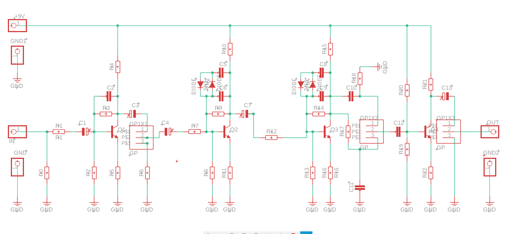
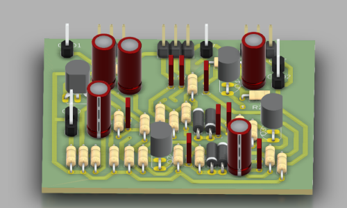

# Simple guitar fuzz based big muff

The Big Muff is a legendary guitar effects pedal known for its iconic fuzz tone. Its construction typically includes three stages: input buffer, clipping circuit, and output buffer. The input buffer maintains signal integrity, the clipping circuit generates the characteristic distortion, and the output buffer ensures signal strength. Its distinctive sound is cherished by guitarists worldwide

# Schematic

# 3d model

# files

### BRD:
[footprint.brd](footprint.brd)
### STL:
[model.stl](model.stl)
### SCH:
[schematic.sch](schematic.sch)

# Sample photos

